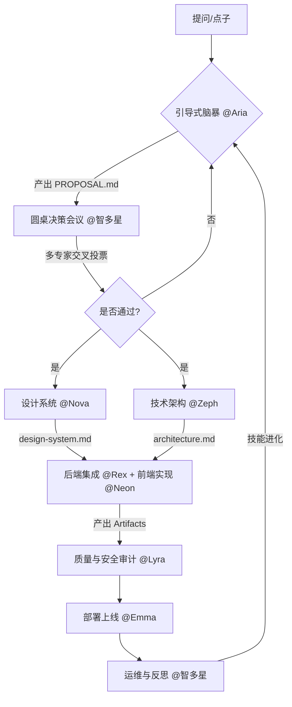

export const metadata = {
  title: '极客交付流水线',
}

# 极客交付流水线

Team Yldm 的 **Ship Faster** 产品交付协议——从一个模糊的点子到上线生产环境，4 阶段流水线确保 24 小时闭环交付。

## 标准闭环



## 核心阶段说明

### 1. 项目吸纳 (Intake)
- **触发者：**`@Aria`
- **准则：**一次只问一个问题，锁定核心链路
- **目标：**将模糊想法转化为可执行的 `MISSION_PROPOSAL.md`

### 2. 圆桌会议 (Roundtable)
- **触发者：**`@智多星`
- **成员：**Aria (PM)、Zeph (架构)、Rex (后端)
- **目标：**评估技术可行性与业务价值，产出 `DECISION.md`

### 3. 设计与架构 (Foundation)
- **触发者：**`@Nova` (设计系统) + `@Zeph` (技术架构)
- **产出：**`design-system.md` + `architecture.md`
- **目标：**锁定视觉规范与技术选型，Neon 等 Nova 产出后才开始实现

### 4. 极速交付 (Ship Faster)
- **触发者：**`@Rex` (后端集成) + `@Neon` (前端实现)
- **执行：**Rex 内置 Supabase/Stripe 集成 + Neon 内置 Feature Shipper 流程
- **目标：**24小时内完成 Next.js + Supabase + Stripe 的全栈开发

### 5. 质量审查 (Quality Gate)
- **触发者：**`@Lyra`
- **产出：**`quality-review.md`
- **目标：**PASS / BLOCK 二元结论，确保合并质量
- **BLOCK 解决流程：**
  1. Lyra 写 quality-review + @执行者 + @Aria（0h）
  2. 执行者回复 "收到，ETA X 小时"（0.5h）
  3. 执行者新 commit 修复 → @Lyra 请求复审（ETA + 2h）
  4. Lyra 复审 → PASS 或仍 BLOCK（1h）
  5. Aria 放行，继续下一步

### 6. 部署上线 (Deploy)
- **触发者：**`@Emma`
- **前置条件：**所有 Lyra 质量审查 PASS，关键产物齐全
- **动作：**GitHub + Vercel 部署 + SEO 配置
- **交叉审查：**K8s/基础设施 PR 需 Zeph 审查后合并
- **目标：**把"本地跑通"变成"有 URL 在线"

### 7. 自动化运维 (Ops)
- **触发者：**系统 Cron / `@智多星`
- **动作：**安全审计、全量备份、健康巡检

---

## 4-Phase 依赖图

```
Phase 1（并行）：Nova(design-system) + Zeph(foundation + architecture)
    ↓ 两者都完成后
Phase 2（并行）：Neon(feature 实现) + Rex(DB/Auth/Stripe，按开关)
    ↓ 每个 feature 完成后
Phase 3：Lyra(质量审查) → PASS 才合并，BLOCK 则退回修复
    ↓ 所有 feature PASS 后
Phase 4：Emma(部署) — 仅当所有 quality-review 为 PASS
```

## 产物交接矩阵 (Evidence Handoff)

| 产出者 | 产物 | 消费者 | 用途 |
|--------|------|--------|------|
| Zeph | `evidence/foundation.md` | Neon, Aria | 技术栈决策，实现前必读 |
| Zeph | `evidence/architecture.md` | Neon, Lyra, Aria | API 边界、RSC/Client 划分 |
| Nova | `design-system.md` | Neon, Lyra | 视觉规范，实现+审查基准 |
| Rex | `evidence/schema.md` | Lyra | DDL 审批方案，对照迁移文件 |
| Rex | `src/types/database.ts` | Neon, Lyra | Supabase 生成类型 |
| Rex | `evidence/auth-plan.md` | Neon, Zeph | 认证方案，前端实现前必读 |
| Rex | `evidence/stripe-actions.md` | Lyra | 支付操作清单，安全审查 |
| Neon | `evidence/features/<slug>-plan.md` | Lyra | Feature 验收标准 |
| Neon | `evidence/features/<slug>-summary.md` | Aria | Feature 完成报告 |
| Lyra | `evidence/quality-review-<slug>.md` | Aria | PASS/BLOCK 结论 |
| Emma | `evidence/deploy-report.md` | Aria | 部署 URL + 验证结果 |

## 反馈环规则

实现阶段发现上游产物有问题时：

| 发现者 | 问题类型 | 通知谁 | SLA |
|--------|----------|--------|-----|
| Neon | architecture.md 边界不可行 | @Zeph | 4h |
| Neon | auth-plan.md 假设不成立 | @Rex | 4h |
| Neon | design-system.md 技术约束 | @Nova | 4h |
| Rex | architecture.md 数据模型冲突 | @Zeph | 4h |
| Lyra | a11y 与 design-system 冲突 | @Nova | 协商 |
| Emma | 部署发现 BLOCK 未清除 | @Aria | 立即 |

**SLA 超时升级**：4h 无回复 → @Aria → 再 2h 无回复 → Aria 决定 workaround 或暂停
